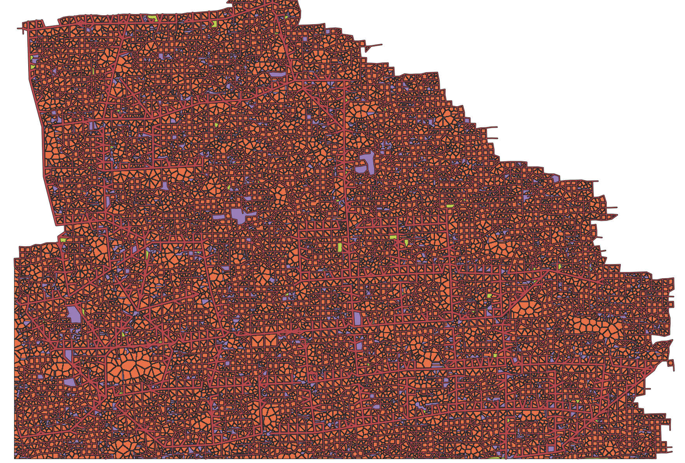

# RandomLand

Für Forschungsaktivitäten rund um die Wärmewende werden häufig Daten von Gebäuden (u.a. Fläche, Alter, Wohneinheiten,
Wärmebedarf, Heizungstyp, etc.) benötigt.
Nun ergibt sich für Veröffentlichungen zumeist das Problem, dass bei Echtdaten verschiedene Restriktionen greifen (
Datenschutz, Unbundling, kritische Infrastruktur, Betriebsgeheimnis, etc.).
Um dennoch detaillierte Berechnungen und Sensitivitätsanalysen zu den verschiedensten Fragestellungen anstellen und
veröffentlichen zu können, soll in dieser Arbeit eine Anwendung erstellt werden, mit der

- relevante Daten zu Gebäuden,
- Flurstücken,
- Siedlungsstrukturen,
- Einwohnern/Nutzerverhalten zufällig erzeugt werden.

Es handelt sich also um synthetische Daten.

## Vorgehen

- Zu Beginn wird eine Population-Heatmap [OpenSimplex2](https://github.com/phishman3579/java-algorithms-implementation)
  generiert. Das sorgt bei jeder Anfrage zu einer zufälligen Verteilung der Bevölkerungsdichte.
- RoadSystem wird durch das Lindenmayer-System generiert. Genauer wird hier eine vereinfachte Version vom
  Algorithmus Parish und Müller [link](https://cgl.ethz.ch/Downloads/Publications/Papers/2001/p_Par01.pdf) verwendet.
  Vereinfacht heißt in diesem Fall, es wurden weniger Regeln implementiert. Kurz: Hier
  werden mithilfe von Globalen und Lokalen Regeln Straßenabschnitte angelegt oder nicht.
- Danach werden die Polygone aus dem Straßennetz extrahiert -> Baublöcke
- Innerhalb der Baublöcke werden Flurstücke und deren Nutzung gesetzt.
- Nach
  gesammelten [Informationen](https://www.gebaeudeforum.de/wissen/zahlen-daten/gebaeudereport-2023/interaktive-diagramme/kapitel-1/)
  werden Wohngebäude und nicht Wohngebäude verteilt.
- Am Ende werden alle Geometrien entweder als Geopackage oder CVS exportiert.

## Warum L-System

In der Arbeit von Kelly und
McCabe [A Survey of Procedurl Techniques for City Generation](http://www.citygen.net/files/Procedural_City_Generation_Survey.pdf)
werden verschiedene Ansätze zur Generierung von Straßennetzen miteinander verglichen.
Kriterien:

1. **Realism** – Does the generated city look like a real city?
2. **Scale** – Is the urban landscape at the scale of a city?
3. **Variation** – Can the city generation system recreate the
   variation of road networks and buildings found in real cities or
   is the output homogeneous?
4. **Input** – What is the minimal input data required to generate
   basic output and what input data is required for the best
   output?
5. **Efficiency** – How long does it take to create the examples
   shown and on what hardware are they generated? How
   computational efficient is the algorithm?
6. **Control** – Can the user influence city generation and receive
   immediate feedback on their actions? Is there a tactile intuitive
   method of control available or is the control restricted? To
   what degree can the user influence the generation results?
7. **Real-time** – Can the generated city be viewed in real-time?
   Are there any rendering optimisation techniques applied to
   enable real-time exploration?

Wonach der Ansatz von Perish und Müller mit dem L-System einer der vielversprechendsten ist.

## Objekt die generiert werden

- Baublöcke
    - Shape
- Flurstück
    - Shape
    - Nutzungsart: Straße, Park oder Gebäude
- Gebäude
    - Shape
    - Volumen
    - Baujahr
    - Nutzungsart: Wohnen, Gewerbe, Halle oder unbeheizt
    - Wohnnutzung mit Anzahl Wohneinheiten
    - Energieträger: Heizöl, Erdgas, Fernwärme
    - TO-DO: Monatliche Durchschnittstemperatur und Normaußentemperatur

## Export

- zip mit mehreren Geopackages: Straße, Baublöcke, Flurstücke und Gebäude
- zip mit mehreren CSV Dateien: -"-
- Beide Formate beinhalten alle generierten Werte, wie im obigen Teil aufgelistet

## Screenshot



## How to start

Ausführbares .jar erstellen:

 ```
 mvn install
 ```

In Ordner target/quarkus-app Befehl ausführen:

 ```
 java -Dquarkus.config.locations=<path/to/config> -jar target/quarkus-app/quarkus-run.jar
 ```

## How to generate

```
POST <url>/gen/generate/{exportType}
```

exportType = gpkg, csv   
returns uuid for generation, optional query parameter seed

```
GET <url>/gen/status/<uuid>
```

Returns current status of job

```
GET <url>/gen/getGpgk/<uuid>
```

Returns current geopackage as zip

## Bestehende Probleme

- [ ] Flurstücke optimiert verteilen
- [ ] Bug im Erstellen der Gebäudeumrisse
- [ ] Generierung des Straßennetzwerks beschleunigen (Multithreading?)
- [ ] Erstellen der JTS Geometry des Straßennetzwerks langsam (Geometry.union()) -> Geotools vermindert verwenden

## Third-Party Libraries

- [java-algorithms-implementation](https://github.com/phishman3579/java-algorithms-implementation)
- [OpenSimplex2](https://github.com/KdotJPG/OpenSimplex2)
- [Geotools](https://www.geotools.org/)


